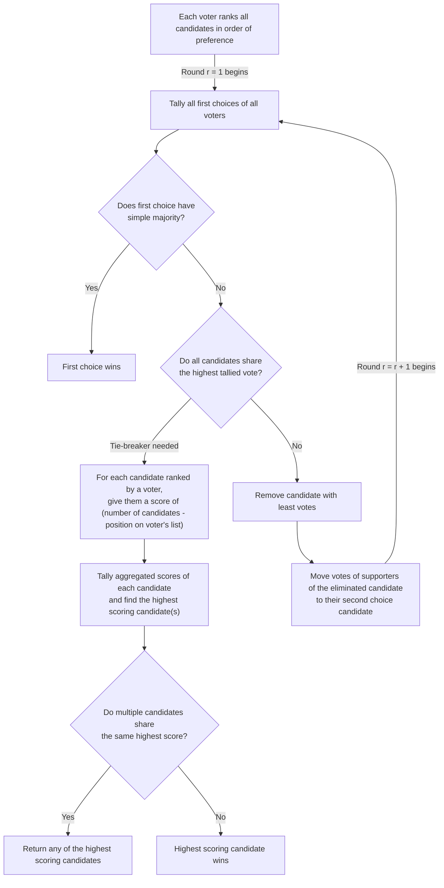

# ranked-voting
Simple API for [ranked-choice voting](https://www.rankedvote.co/guides/understanding-ranked-choice-voting/how-does-ranked-choice-voting-work) in an election.

Ranked-voting is a Flask app that serves API endpoints for a ranked-choice voting, supporting both creation of elections, retrieval of results and casting of votes using HTTP requests.

## How does Ranked-Choice Voting Work?



If the above flowchart does not render, visit this [link](https://mermaid.live/view#pako:eNp9VE1z2jAU_CtvdGk6hUOvTJtOEyCEfhxSLh2bg7Ae9mssySPJdBjgv_dJhthkJuXgMfK-3fWu5IMorEIxEaWTTQWraW6Af1-zmSwq2NmADpw0zx5kXUMhjSIlA3ogA9Ypfmq30DjcokNT4BrG41s4PtnWKHDwGT7CBksy_gh32Yop9olnS84HKCpLBVMxQ1xMYn7dGbhLRPeHqWXAEA6V3OGnjbv1pJsaQcs_1lHYfzl1g_edg9_IktNsPpz8yz7WV6if9ggz1nj9cr6SLomEigWprJBZAoMIVfJ5UZv1PPPsCbXdYc_DgqGCGiUPx6GL-HloRTjeOJTPHKJBVKiOsMhyMbcOMKbfE8UGWHnD6XUxjaK5kliNHWpe9YV1GJO8Ma3edLUMXmgMjfUUyHJrpqN456EmH97n4mxrkWw9soNzUWXpsORx1bGnoq6NRRd8zwXxZZhVHCBT9sgb3ws9JqFlzF23daBY41vhe6mvWV-iXw6K_sbZh9YZkGYfXf7XyqWGZd_d92zxFnq4a-Zp4iH7EWtOjUYx3zaNdXHvXqSxJk0mJXcVVbDxMTnwWFhO7LwvXzBnmYfXh8jBh-FB6lDxKkZCo9OSFJ_gQ1zJRdwQmIsJ3yrcSg44F7k5MbRtoshMUbBOTIJrcSRkG-yvvSku_zvMlCR_D3S3ePoHL9pnVg) to view the flowchart. You can also view it [here](/img/ranked-choice-voting-algorithm.jpg).

# How to use ranked-voting

## Create an Election

Creation of elections is performed by sending either a `GET` or `POST` request. 

### ```GET```

A `GET` request is the quickest way to setup a ranked-choice election, but offers no customization options since all fields take their default values. Create an election by appending a `/` separated list of candidates to the `/add` endpoint. 

```bash
curl --location --request GET 'https://ranked-voter.herokuapp.com/add/pancakes/waffles/ice-cream'
```

### ```POST```

You can also create an election by sending a `POST` request. This is the most flexible way to create an election, but requires you to specify the fields you wish to customize.

The request body is a JSON object with the following fields:

```json
{
    "election_id": {OPTIONAL} A custom ID for the election. If not provided, a random ID will be generated.
    "election_name": {OPTIONAL} The name of your election
    "start_time": {OPTIONAL} when does the election start?
    "end_time": {OPTIONAL} when does the election end?
    "description": {OPTIONAL} A short description of your election
    "anonymous": {OPTIONAL} true or false
    "candidates": ["candidate-1", "candidate-2", ...]
}
```

An example is provided below:

```bash
curl --location --request POST 'https://ranked-voter.herokuapp.com/add' \
--header 'Content-Type: application/json' \
--data-raw '{
    "election_name": "Food ranking",
    "description": "Rank your favourite foods!",
    "candidates": ["pancakes", "ice-cream", "waffles"],
    "anonymous": true
}'
```

Once you create an election, you will be shown the `ELECTION_ID`. Remember to use this ID when casting your votes and to access results.

## Retrieve Results

You can view your election results by sending a `GET` request to the `/ELECTION_ID` endpoint.

An example is provided below:


```bash
curl --location --request GET 'https://ranked-voter.herokuapp.com/ELECTION_ID'
```

## Remove an Election

You can remove an election by sending a `GET` request to the `/vote/ELECTION_ID` endpoint. Note that this action is irreversible and can only be performed by the person who created the election.

```bash
curl --location --request GET 'https://ranked-voter.herokuapp.com/remove/ELECTION_ID'
```

## Cast your votes

You can cast your votes by sending a `GET` request to the `vote/ELECTION_ID` endpoint. Append the URL with the ordered candidates, separated with a ```/```. Remember to include all the candidates since this is a ranked-choice voting.

An example is provided below:

```bash
curl --location --request GET 'https://ranked-voter.herokuapp.com/vote/ELECTION_ID/pancakes/icecream/waffles'
```

## Remove your vote

You can remove your vote by sending a `GET` request to the `/unvote/ELECTION_ID` endpoint. Note that this action will remove only your vote, not all votes.

```bash
curl --location --request GET 'https://ranked-voter.herokuapp.com/unvote/ELECTION_ID'
```

# How to setup the ranked-voting app

1. Clone the repository and navigate to the root directory
    ```bash
    git clone https://github.com/aditeyabaral/ranked-voting
    cd ranked-voting
    ```

2. Create a new Python3 environment and activate it
    ```bash
    virutalenv ranked-voting
    source ranked-voting/bin/activate
    ```

3. Install the requirements
    ```bash
    pip install -r requirements.txt
    ```

4. Create a `.env` file and add a database connection URL
    ```bash
    APP_DATABASE_URL="<YOUR-DATABASE-URL>"
    ```

5. Run the app
    ```bash
    python3 app/app.py
    ```
